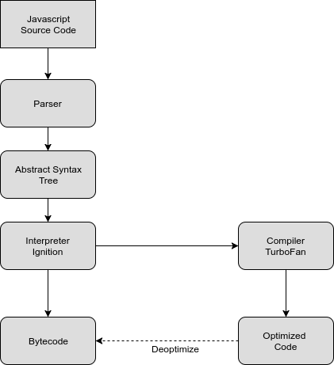

# Estudo da linguagem javascript

* Características da linguagem

## Conceitos JS

* [Sintaxe básica](content/basic_syntax.md)
  * var, let, const
  * null vs undefined
  * Operadores
  * typeof
  * Conversao de tipos
* [Functions](content/functions.md) 
  * Declaration
  * Expression
  * Anonymous
  * Arrow
* [Scope chain (Hoisting)](content/hoisting.md)
* [Execution context](content/execution_context.md)
* [Closures e Funções Aninhadas](content/closures.md)
* [By value & By reference](content/byvalue_byreference.md)
* [A keyworkd **this**](content/this_keyword.md)
* [Criação de Objetos](content/object_creation.md)
* [Json vs object literals](content/json_vs_object_literals.md)
* [**this** keyword](content/this_keyword.md)
* [Constructor](content/constructor.md)
* [Inheritance e Prototype chain (herança de protótipos)](content/inheritance.md)
* [Call, Bind, Apply](content/call_bind_apply.md)
* [Bom (Browser Object Model)](content/bom.md)
* [Dom (Document Object Model)](content/dom.md)
* [use strict](content/use_strict.md)
* [Callback](content/callback.md)
* [Event bubbling, capturing](content/event_bubbling_capturing.md)
* Eventos de tempo
  * setTimeout
  * setInterval
* Tratamento de erros
  * try, catch
  * finally 
  * throw
* Requisições
  * AJAX - XMLHttpRequest
  * Websockets
* Segurança
  * Não usar eval
  * http vs https

## Tecnicas / Design Patterns

* [Dependency injection](content/dependency_injection.md)
* [Iifes (Imediatelly Invoked Function Expression)](iifes.md)
* [Object Orientation](content/object_orientation.md)
* [Factories](content/factories.md)
* [Composition](content/composition.md)
* [Currying](content/currying.md)
* [Partials](content/partials.md)
* [Functors](content/functors.md)
* [Constructors](content/constructor.md)
* [Stream](content/stream.md)
* Prototype Pattern
* Module Pattern
* Revealing Module Pattern
* Builder
* Façade
* Strategy
* Builder
* Constructors
* Trampolim
* Outros patterns famosos

## Javascript moderno (ES5>)

Desde a versão 52, o Chrome suporta ES6 e ES7.

* [Symbols](content/symbols.md)
* [Classes](content/class.md)
* [Template Literals](content/template_literals.md)
* [Spread Operator](content/spread.md)
* [Rest Operator](content/rest_operator.md)
* [Arrow Functions / Lambda](content/functions.md)
* [Destructuring](content/destructuring.md)
* [Map, Set, WeakMap, WeakSet (data structures)](content/data_structures.md)
* import/ export (modules)
* [Map, reduce, filter, forEach](content/map_reduce_filter.md)
* [Promises](content/promises.md)
* [Async await](content/async_await.md)
* [Generators](content/generators.md)
* [Iterators & For of, For in](content/iterators.md)
* [Proxies/Reflect (Intercept properties access)](content/interceptable.md)
* [Promises](content/promises.md)
* [Async Await](content/async_await.md)

## Manipulação de DOM

* Definição de DOM
* Seletores
* Eventos
  * Keyboard
    * keydown
    * keyup
    * keypress
  * Mouse
    * click
    * dblclick
    * mouseup
    * mousedown
* Manipulação de Nós 
  * createElement
  * appendChild
  * insertBefore
  * replaceChild
  * removeChild
* addEventListener
* Problemas do DOM

## BOM

* window
* document

## Armazenamento

* Cookie
* LocalStorage
* SessionStorage

## Debug

Usando Chrome dev Tools:
* Abas
  * Elements
    * Alterando CSS
    * Alterando Dom
    * Filtro de busca
    * Valores computados
    * Listeners
    * Dom Breakpoints
  * Console
  * Sources
    * Sources
    * Snippets
  * Network
    * Analisar Requisição
  * Performance
    * Analise de performance
  * Memory
  * Application
  * Security
  * Audits
  * Modo Mobile

## V8 usa JIT (Just In Time Compilation)

O V8 é uma engine javascript de codigo aberto criada e mantida pelo Google, escrita em C++. É usada no Google Chrome e no Node.js. O V8 pode rodar sozinho ou dentro de outra aplicação C++.

### Turbofan

Turbofan é um compilador de otimização.

* Melhor performance de execução comparado com Ignition;
* Mais lento para gerar codigo, mas é mais otimizado;

### Ignition

O Ignition é um interpretador baseado em registradores de baixo nivel que usa o backend do Turbofan.

* Para ambientes de pouca memória, inicialmente usado para dispositivos mobile, agora usado em todas plataformas;
* Rapida geração de bytecode, melhora velocidade de startup das paginas;
* Integra com Turbofan, faz otimização com turbofan mais simples;

### Bytecode Pipeline

### Orinoco

